

  

<h1 align="center">Nicolas Pedemonte</h1>

  Systems Engineering Student &nbsp;&middot;&nbsp; Graduated as University Systems Analyst Developer 
  Interested in Data, ML, and everything that happens at the intersection of software and intelligence.

  
  &nbsp;
  

---

<strong>Work I've done with others</strong>

 

**[UpSkill](https://github.com/upskill-team)** — Course management platform built as a team for the Software Development course at university. Full-stack TypeScript, REST API, complete frontend.

&nbsp;&nbsp;→ [`Back-End-DSW`](https://github.com/upskill-team/Back-End-DSW) · [`Front-End-DSW`](https://github.com/upskill-team/Front-End-DSW)

 

**[SIGMA-LA](https://github.com/SIGMA-LA)** — Information system developed collaboratively. Covers both API and client layers end-to-end.

&nbsp;&nbsp;→ [`Back-End-SIGMA-LA`](https://github.com/SIGMA-LA/Back-End-SIGMA-LA) · [`Front-End-SIGMA-LA`](https://github.com/SIGMA-LA/Front-End-SIGMA-LA)

<strong>Open source</strong>

 

**[AnyLogicWebToolkit](https://github.com/NiconiKimg/AnyLogicWebToolkit)** — Java library for embedding modern web UIs directly into AnyLogic simulation models. 

**[github-profile-orbit](https://github.com/NiconiKimg/github-profile-orbit)** — GitHub Action that generates the visualizations below.

---

  <picture>
    <source media="(prefers-color-scheme: dark)" srcset="dist/space-dark.svg">
    <source media="(prefers-color-scheme: light)" srcset="dist/space-light.svg">
    
  </picture>

  <picture>
    <source media="(prefers-color-scheme: dark)" srcset="dist/network-dark.svg">
    <source media="(prefers-color-scheme: light)" srcset="dist/network-light.svg">
    
  </picture>

Updated automatically every night via GitHub Actions · includes contributions to external organizations.