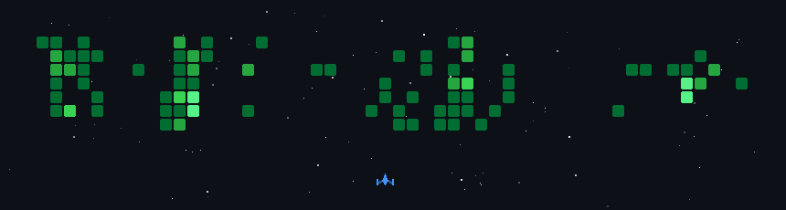

  

<h1 align="center">Nicolas Pedemonte</h1>

  <strong>Systems Engineering Student &nbsp;&middot;&nbsp; University Systems Analyst &amp; Developer</strong> 
  <em>Focused on Data, Machine Learning, and robust software architectures at the intersection of intelligence and systems design.</em>

  
  &nbsp;
  
  &nbsp;
  

---

### 🤝 Collaborative & Team Engineering

<strong>Featured Team Projects</strong>

 

* **[Hyperparameters-Optimization](https://github.com/LucaTvl/Hyperparameters-Optimization)** — Neural Architecture Search (NAS) and hyperparameter optimization framework utilizing Zero-Cost Proxies (ZCP), Genetic Algorithms (GA), and Multi-Objective Evolutionary Optimization (NSGA-II) evaluated on NATS-Bench and CIFAR-10.
  
  &nbsp;&nbsp;`Python` &middot; `PyTorch` &middot; `Genetic Algorithms` &middot; `NAS` &middot; `NSGA-II` &middot; `Data Analysis`

 

* **[UpSkill](https://github.com/upskill-team)** — Comprehensive course and learning management platform developed collaboratively for the university Software Development curriculum. Features modular micro-architecture and full-stack integration.
  
  &nbsp;&nbsp;→ Repositories: [`Back-End-DSW`](https://github.com/upskill-team/Back-End-DSW) &middot; [`Front-End-DSW`](https://github.com/upskill-team/Front-End-DSW)  
  &nbsp;&nbsp;`TypeScript` &middot; `Node.js` &middot; `REST API` &middot; `Frontend UI`

 

* **[SIGMA-LA](https://github.com/SIGMA-LA)** — Full-featured enterprise management and information system engineered end-to-end, providing robust business logic workflows and dynamic client interfaces.
  
  &nbsp;&nbsp;→ Repositories: [`Back-End-SIGMA-LA`](https://github.com/SIGMA-LA/Back-End-SIGMA-LA) &middot; [`Front-End-SIGMA-LA`](https://github.com/SIGMA-LA/Front-End-SIGMA-LA)  
  &nbsp;&nbsp;`Full Stack` &middot; `API Architecture` &middot; `Relational Database`

---

### 🛠️ Open Source & Tools

* **[AnyLogicWebToolkit](https://github.com/NiconiKimg/AnyLogicWebToolkit)** — Java library enabling developers to embed modern web user interfaces directly into AnyLogic simulation models.  
  

* **[github-profile-orbit](https://github.com/NiconiKimg/github-profile-orbit)** — Custom GitHub Action that dynamically tracks external organizational contributions and generates the interactive ecosystem visualizations shown below.

---

### 🌌 Ecosystem & Contribution Orbit

  <picture>
    <source media="(prefers-color-scheme: dark)" srcset="dist/space-dark.svg">
    <source media="(prefers-color-scheme: light)" srcset="dist/space-light.svg">
    
  </picture>

  <picture>
    <source media="(prefers-color-scheme: dark)" srcset="dist/network-dark.svg">
    <source media="(prefers-color-scheme: light)" srcset="dist/network-light.svg">
    
  </picture>

---

  

  Contribution graph rendered as a space shooter via <a href="https://github.com/czl9707/gh-space-shooter">gh-space-shooter</a>

